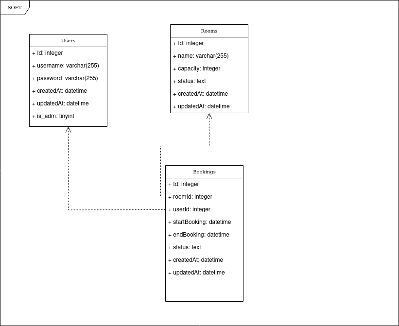

# SOFT - Sistema Básico de Reserva de Salas

O Sistema Básico de Reserva de Salas foi desenvolvido como parte da avaliação da 2ª fase do Processo Seletivo de Engenharia de Software do CIn - 2023. Este projeto foi selecionado devido à sua complexidade inerente, envolvendo múltiplos relacionamentos, principalmente entre reservas, indivíduos e salas, e o gerenciamento de valores datetime.

A solução foi desenvolvida utilizando o framework Express no back-end e React no front-end. A escolha do Express deve-se à sua eficiência na configuração, considerando o prazo desafiador, enquanto o React foi selecionado devido à sua compatibilidade com uma ampla variedade de bibliotecas de estilização. Inicialmente, o SQLite3 foi escolhido como sistema de gerenciamento de banco de dados devido à sua leveza e facilidade de configuração. No entanto, há planos para migrar para o Postgres no futuro. Para otimizar a configuração do ambiente de desenvolvimento, foram empregados o Docker e o Docker Compose.

O nome "SOFT" surge para representar a eficiência e agilidade na criação desta solução.


## Como rodar:

- Com Docker (Recomendado)

```
# instalar e configurar o docker em máquina local 
docker compose up --build -d

# Testar versão com servidor Nginx
docker compose -f docker-compose-with-nginx.yml up --build -d
```

- Sem Docker (Manualmente)
```
# Com o Node node v18.16.0

# Terminal 1
cd backend
npm i
node src/server.js

# Terminal 2
cd frontend
npm i
npm start
```

_Em ambos processos de instalação e inicialização o **client** irá rodar na porta 3000 ([http://0.0.0.0:3000](http://0.0.0.0:3000)) e o **server** irá rodar na porta 8080 ([http://0.0.0.0:8080](http://0.0.0.0:8080))

## DB



### Limitações

1. Por se tratar de um projeto fictício, não implementei uma forma segura de autorizar um usuário administrador. Basta um usuário marcar a opção "Sou administrador" na tela de registro para que o mesmo tenha acesso á área administrativa.
2. Já que estou usando o LocalStorage para armazenar o JWT, não é indicado pôr este sistema fictício em produção para evitar ataques do tipo XSS. Deve ser implementado uma forma mais segura como CSP ou libs como DOMPurify.
3. Não foi implementado um sistema de BlackListToken, ou seja, não é possível deslogar (no back-end) um usuário.
4. Por algum motivo não consegui inserir o nome dos usuários na tabela do administrador.

## Boas práticas

Para garantir que utilizo boas práticas, busquei:

- Utilizar JWT na autenticação dos usuários
- Utilização de GitFlow
- Arquitetura e organização de pastas popular
- Uitilização de Migrações de Banco de Dados via Sequelize
- Utilização de Variáveis de ambiente
- Documentação de API via Swagger [http://0.0.0.0:8080/api/docs](http://0.0.0.0:8080/api/docs)
- RESTFul Patterns
- Styled Components
- Algumas boas práticas de UI

Requisitos:

- [X] O aluno deve ser capaz de criar a requisição;
- [X] A requisição deve conter: setor, tipo da requisição, data e hora, texto com o conteúdo da requisição;
- [X] O setor responsável pelo atendimento deve visualizar as requisições recebidas ;
- [X] O setor deve poder fechar a requisição;
- [X] O aluno pode acompanhar o status da requisição (aberta ou concluída);
- [X] Pelo menos uma tabela com filtros e paginação;
- [X] Criar DER ou MER do banco de dados;
- [ ] Criação de testes automatizados;
- [X] Deve constar um readme com orientações e comandos necessários para rodar o projeto em ambiente local, bem como a versão utilizada do node para replicação dos testes.

Observação: Possuo experiência com TDD mas em Python com Pytest e Selenium, daí resolvi desenvolver parte da Infra no lugar.

## Infra


